# GRS_AD64_decode
This is the code used to decode packages from GRS_AD64, based on version 2.0 2019.06 data sheet

## How to use the code
To use this code, `python3` and packages of `numpy`,`matplotlib`,`tqdm` are requied. To use the code, put the code in the same path as with the .bin file from the data collecting board, create a folder `output` in the same dictionary, change variable `file_name` in line `9` to your bin file name
```
file_name = "you_bin_file_name.bin"
```
The code used to unpack the package is everything above the dash line i.e. line`215` in this version, the rest are used for data anaylsis.

## How the code works
This is a flow chart of the unpack code.

```mermaid
graph LR;
  A["Read .bin file"]-->B["Find package head and tail"]
  B-->C["Check pack error, package length"]
  C-->D["Use board id, package id and time of repentance of package id to label a general package"]
  D-->E["Unpack subpackage"]
  E-->F["Label wave data package"]
  F-->G["Find subpackage channel id, subpackage trigger source and subpackage trigger count"]
  G-->H["Unpack wave data"]
  H-->I["Use board id, channel id and time stamp to re-label a general package"]
  I-->J["Process external trigger (if there`s one)"]
```


## How to use the result generate by the coed
Here Im going to list important virables generate by the code (unpack part)<br/>
`file` is the original file opened<br/>
`idx_head` labeled index of package heads in `file`<br/>
`wave_sample_data` contians wave datapoints<br/>
`if_data_package` labels if a subpackage is a datapackage or a external trigger package<br/>
`existed_board_id`,`existed_channel_id`,`existed_time_stamp` are virables contain all possible number of board id, channel id and time stamp existed in the file, respectively.<br/>
`pack_pointer_board_channel_timeStamp` contians pointers labeled with `board id`,`channel id` and `time stamp`<br/>
`pack_pointer_board_channel_timeStamp_valid` contians boolean value if a package labeled with `board id`,`channel id` and `time stamp` exists<br/>
Here is an example<br/>
say if we have `existed_board_id = [Bid1,Bid2,...]`,`existed_channel_id = [Cid1,Cid2,...]`,`existed_time_stamp = [TS1,TS2,...]`
`pack_pointer_board_channel_timeStamp_valid[0,1,0] == True` means there is a data package with `board id = Bid1` and `channel id = Cid2` at `time stamp = TS1` (`if_data_package[pack_pointer_board_channel_timeStamp[0,1,0]] == True`). The index of head of this package in `file` is `head[pack_pointer_board_channel_timeStamp[0,1,0]]`. Datapoints infomation can be found with `wave_sample_data[idx][wave_sample_data_valid[idx]]`<br/>
External trigger infomation is processed seperately, contained in `ext_tri` and `ext_tri_counts` means how many external datapackages found. 
